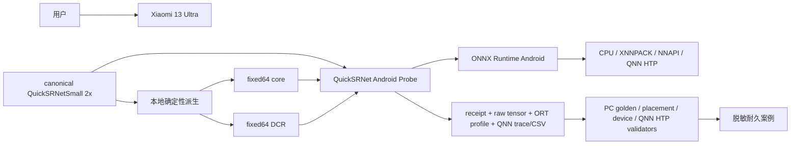
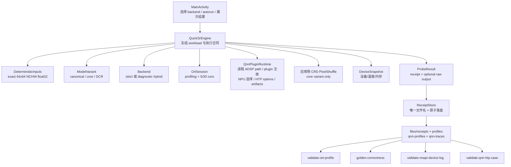
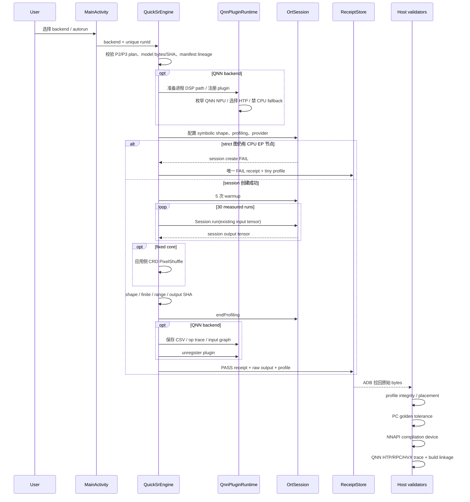

# Android 单帧 P0–P3 架构与设计理由

本页描述当前原型的 context、component、runtime 和 performance flow。它不能替代脱稿讲述、空白手写、面试回放或人工审核。

## Context 图



边界：App 不上传数据、不读取相册或摄像头、不解码视频。stock ORT AAR 的旧 QNN probe 失败仍保留为历史负面证据；P3 使用独立 Qualcomm QNN plugin/runtime 接入 HTP，不能把两条路径混为一谈。

## Component 图



设计理由：

- UI、runtime、模型谱系、后处理、设备信息和证据落盘分离，便于以后把相同合同迁到 JNI/C++。
- raw tensor、profile 与 receipt 独立保存；“输出正确”“provider 落点正确”“底层 device 是硬件”不能共用一个布尔值。
- strict backend 禁止默认 CPU EP fallback；diagnostic hybrid 明确允许 CPU 节点，只用于定位，不允许全图声称。
- QNN 初始化必须发生在 `OrtEnvironment`/session 之前：只在 App 进程中把 packaged V73 Skel 目录置于 DSP 搜索路径前部，再注册 plugin、枚举 NPU device、配置 HTP；绝不记录绝对 ADSP path。

## Runtime 流程图



系统冻结、强制停止或掉电可能发生在 App 最终落盘之前。此时主机 observation 必须单独记录，不能伪造成 App FAIL receipt；第一次 NNAPI DCR 尝试就是锁屏后被 MIUI 冻结的 environment timeout。解锁复测随后完整落盘并 PASS，两次证据均保留，不能用成功结果覆盖环境失败。

## Performance flow

```mermaid
flowchart LR
    A[读取/校验 model asset<br/>当前 run latency 外] --> B[生成 input tensor<br/>当前 run latency 外]
    B --> C[createSession<br/>sessionCreateMs]
    C --> D[5 warmups<br/>不进分位数]
    D --> E[30 x Session.run<br/>raw/P50/P95]
    E --> F[output materialization<br/>当前未逐次计时]
    F --> G[应用 PixelShuffle<br/>当前只有单次冷采样]
    G --> H[validation + hash<br/>当前 run latency 外]
    H --> I[profile / receipt / raw tensor 落盘]
```



当前 P1–P3 开启 ORT profiling，因此 P50/P95 只能作为诊断 timing。QNN CSV 的 accelerator/RPC 数字同样用于证明执行路径与定位，不是发布 benchmark。发布 benchmark 必须另立无 profiling 合同，并分别记录：

```text
decode
→ colorspace / normalize
→ input copy
→ ORT inference
→ output materialization
→ PixelShuffle
→ clamp / RGB conversion
→ render
→ complete frame latency
```

任何一步都不能被 `Session.run` 数字代替。

## P2 图变换

### fixed core

```text
input [1,3,64,64]
→ 4 × (Conv + Clip)
→ pre_shuffle_output [1,12,64,64]
→ application CRD PixelShuffle
→ [1,3,128,128]
```

用途：把 canonical 中 XNNPACK 不接管的 `DepthToSpace` 移出图。结果证明它移除了 CPU `DepthToSpace`，但 XNNPACK 的 NHWC/NCHW layout 转换仍产生 2 个 CPU `Transpose`，因此 strict 全图仍失败。

### fixed DCR

```text
input [1,3,64,64]
→ 4 × (Conv + Clip)
→ reordered final channels
→ DepthToSpace(mode=DCR)
→ [1,3,128,128]
```

用途：满足 NNAPI 对 DCR 的支持边界。它在 PC 与 canonical byte-exact，但真机 strict 仍有 CPU EP 节点。解锁后的 hybrid 完成 35 次 run，profile 显示 5 个 NNAPI partition 与 4 个 CPU `Clip`；Android driver 日志又显示 5 次编译均落在 `nnapi-reference`。因此它证明 hybrid runtime 可运行和输出正确，却不能获得全图或 NPU 声称。

## P3 QNN HTP 实际图路径

```text
fixed64 DCR: 11 ONNX nodes
→ ORT QNN EP: 1 fused subgraph
→ 11 QNN ops (4 Conv2d + 4 ReluMinMax + 2 Transpose + 1 DepthToSpace)
→ HTP V73 RPC / accelerator / HVX execution
→ 35/35 strict runs
```

这条路径的 execution/placement/trace/build linkage 均已通过；输出也在两次运行间稳定。它与 PC golden 的既有严格容差比较仍 FAIL，所以架构状态必须写成“HTP execution PASS、correctness FAIL”，而不是笼统的“QNN 完成”。

## 设计取舍与替代方案

### 为什么先用 Java ORT

- 先验证真实 Android lifecycle、AAR、provider 配置、真机输出和证据合同。
- 避免第一次实验同时引入 NDK、JNI、MediaCodec、量化和厂商 SDK。
- Java 不是最终岗位能力终点；JNI/C++ 仍是独立门禁。

### 为什么先用确定性合成输入

- 无版权、权限、decode 和颜色空间歧义。
- 能逐字节固定输入，并把 Android 输出与 PC golden 做逐元素比较。
- 不能评价真实画质；真实动画帧是下一门禁。

### 为什么保留 hybrid

- strict 的职责是证明“无默认 CPU EP”；失败不能解释具体节点。
- hybrid + profile 的职责是定位 CPU/XNNPACK/NNAPI 分界。
- hybrid PASS 只能叫部分 offload，不能叫全图或硬件加速完成。

### 为什么 NNAPI 还要看 Android device log

ORT profile 只记录 `NnapiExecutionProvider`。NNAPI 内部仍可能选择 `nnapi-reference` CPU 实现；因此必须把 EP placement 和 compilation device 分成两轴。出现 reference 时无条件禁止 NPU/HTP 声称。

### QNN HTP 的实际路径与设计理由

P3 已选择独立 Qualcomm ORT QNN plugin/runtime，而不是继续把 NNAPI reference 当作 NPU。理由是它能显式枚举 `hardwareType=NPU`、选择 `backend_type=htp`，并产出 QNN op trace、RPC/accelerator/HVX 证据。替代方案是自定义 ORT/QNN build，但会额外引入工具链与补丁维护成本；在公开 plugin 能完成基础设施探针时暂不采用。QNN 的 execution、correctness、benchmark、thermal 仍是四条独立轴。另一个必须显式建模的边界是 accelerator precision：QAIRT 2.35+ 在支持浮点的 HTP 上始终使用 FP16 math，ORT wrapper 中 `enable_htp_fp16_precision=0` 不能视为严格 FP32 硬件保证。

### 为什么还不直接做播放器

播放器同时耦合 decode、色彩转换、缓冲、推理、调度、同步、丢帧和温控。P3 已证明 HTP 能执行，但也发现 accelerator 数值合同未过；下一步先关闭正确性/画质门禁并加入一张真实版权安全静态帧，再扩 tile/full-frame，最后才接视频。

## 独立能力门禁

机器 PASS 只覆盖实现与复现。以下仍必须独立留证：

1. 运行前预测；
2. context/component/runtime/performance-flow 架构讲述；
3. 设计理由与替代方案；
4. 脱稿解释主要路径；
5. 从空文件手写模型加载、tensor contract、PixelShuffle 或 receipt 骨架；
6. 测试/benchmark 运行与失败分析；
7. 面试回放；
8. 人工 reviewer 打开真实引用并审核。
