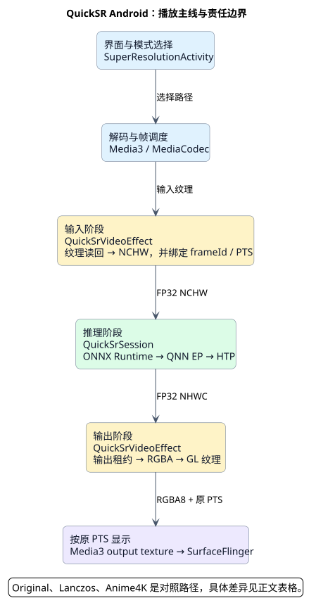
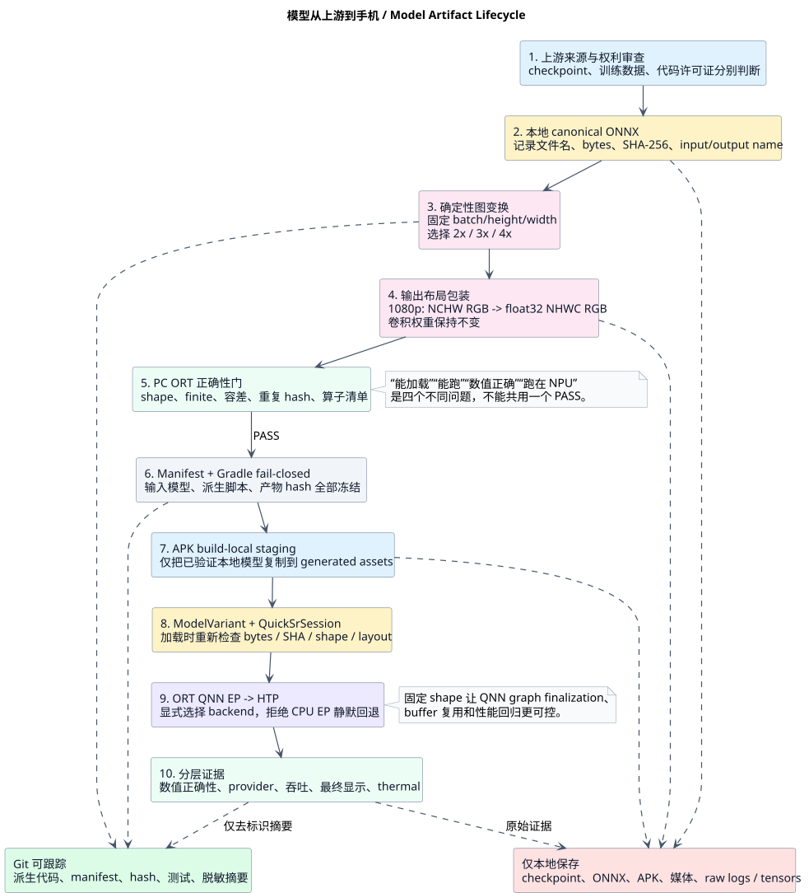
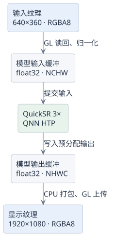
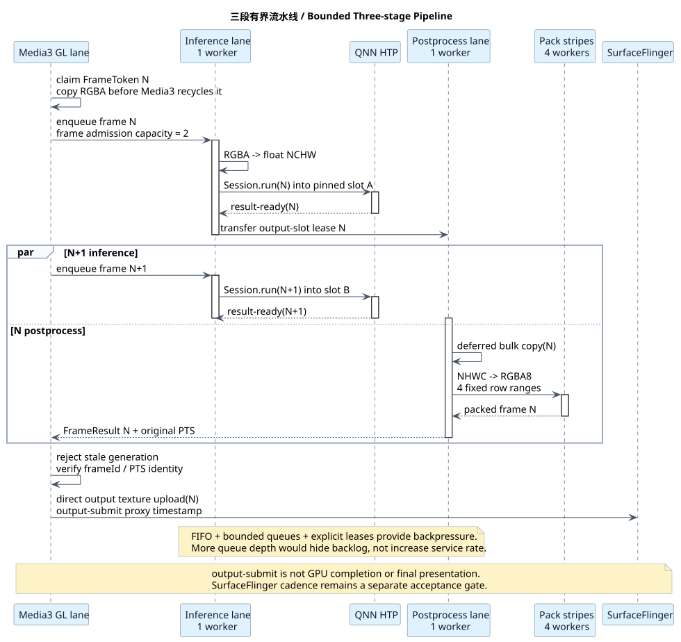
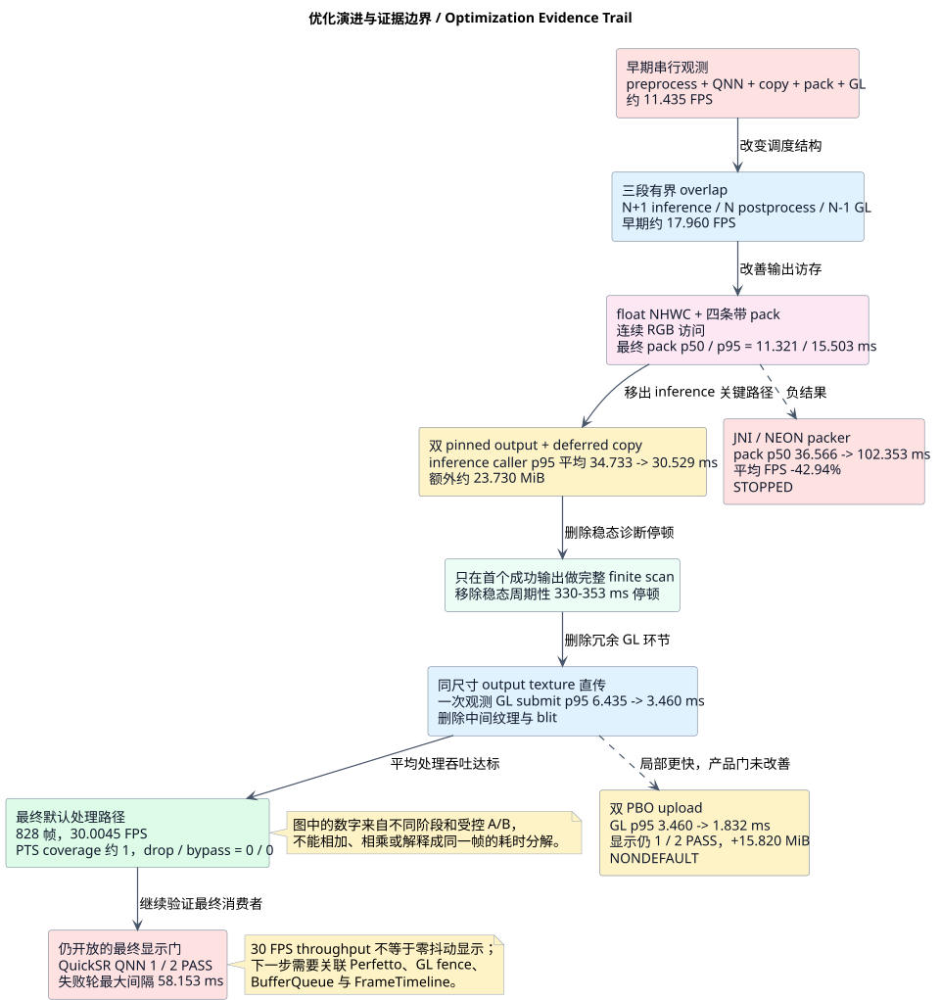

# 端侧模型部署学习报告：从 ONNX 到 Android QNN 实时视频

[返回中文首页](https://github.com/znbsf/quicksr-mobile-player-lab/blob/main/README.zh-CN.md) | [English README](https://github.com/znbsf/quicksr-mobile-player-lab/blob/main/README.md)

这是一份围绕本仓库真实实现编写的入门导读。目标不是只教会“调用一次 ONNX”，而是沿着一个端侧视频模型的完整生命线，理解模型资产、图变换、Tensor、运行时、硬件后端、数据搬运、流水线、播放器时序、性能证据和发布边界如何连在一起。

> 当前项目已经证明一台指定 Qualcomm 设备上的 1080p QuickSR 路径可以达到 30.0045 FPS 平均处理吞吐，但最终显示只有 1/2 严格通过。这份报告会刻意保留这个差异：端侧部署的终点不是 `Session.run()` 返回，而是用户真正看到稳定、正确、同步的画面。

## 1. 先建立端侧部署的全局地图

一个模型进入手机，至少经过六层：

| 层次 | 要回答的问题 | 本项目中的落点 |
| --- | --- | --- |
| 模型资产 | 模型从哪里来，能否使用和分发，文件是否被替换？ | checkpoint/ONNX 来源、bytes、SHA-256、source-only 边界 |
| 图与 Tensor 合同 | 输入输出叫什么、shape/layout/dtype 是什么，算子能否被后端支持？ | fixed shape、NCHW 输入、NCHW/NHWC 输出、DCR DepthToSpace |
| Runtime 与后端 | 谁加载模型，图到底跑在 CPU、GPU 还是 NPU？ | ONNX Runtime、QNN EP、QNN HTP/CDSP、禁止 CPU EP 静默回退 |
| 数据工程 | 一帧在不同内存域之间搬了多少次、占多少内存？ | `GL → CPU → QNN → CPU → GL`、float/RGBA 转换、pinned buffers |
| 实时系统 | 多阶段怎样并行，如何背压，seek/flush 后旧帧会不会串线？ | inference/postprocess/GL 三段流水、容量 2、frameId/PTS/generation |
| 产品证据 | “能跑”“够快”“显示稳定”“音画同步”“画质更好”分别如何证明？ | PC golden、真机 HTP、effect throughput、SurfaceFlinger、A/V、盲审 |

推荐按以下顺序学习：先看代码架构，再看模型生命周期，然后算清数据量，最后理解流水线与证据门禁。不要从“换成 C++”或“再加线程”开始，因为那两件事都无法替代问题归因。

## 2. 代码架构：先知道每层由谁负责

[](diagrams/edge-code-architecture.svg)

[查看 PlantUML 源码](diagrams/edge-code-architecture.puml)

这张图最重要的不是类名数量，而是职责边界：

- `SuperResolutionActivity` 选择模式、档位、素材和 QNN tuning；它不实现 Tensor 算法。
- Media3/ExoPlayer 保留 MediaCodec 解码、源 PTS、seek、Surface 和 GL effect 生命周期。
- `QuickSrVideoEffect` 是实时路径中最复杂的编排层，负责 readback、背压、线程、buffer 所有权、generation、PTS 和最终 GL 交付。
- `QuickSrSession` 只管理模型合同、持久化 ORT session/input/output、推理和 output-slot lease。
- `QnnPluginRuntime` 在 session 建立前准备 QNN 进程环境、注册 EP、选择 HTP 并关闭不允许的 fallback。
- 数据转换与遥测是独立模块；这让“模型时间”“pack 时间”“排队时间”和“显示时间”不会混成一个数字。
- Anime4K 是 GPU-resident 替代路径，并不经过 QuickSR 的 QNN Tensor 往返。

### 建议的代码阅读顺序

| 顺序 | 文件 | 重点问题 |
| ---: | --- | --- |
| 1 | [`app/build.gradle.kts`](https://github.com/znbsf/quicksr-mobile-player-lab/blob/main/app/build.gradle.kts) | 模型名、bytes、hash、版本和实验开关如何在构建期冻结？ |
| 2 | [`ModelVariant.java`](https://github.com/znbsf/quicksr-mobile-player-lab/blob/main/app/src/main/java/dev/aisystems/quicksrplayerlab/ModelVariant.java) | 一个模型变体如何声明 asset、I/O shape、layout 和元素数量？ |
| 3 | [`QuickSrSession.java`](https://github.com/znbsf/quicksr-mobile-player-lab/blob/main/app/src/main/java/dev/aisystems/quicksrplayerlab/QuickSrSession.java) | 如何持久化 ORT session、input tensor 和两个 output slot？ |
| 4 | [`QnnPluginRuntime.java`](https://github.com/znbsf/quicksr-mobile-player-lab/blob/main/app/src/main/java/dev/aisystems/quicksrplayerlab/QnnPluginRuntime.java) | QNN EP/HTP 如何注册，失败时如何关闭而不是回退？ |
| 5 | [`QuickSrVideoEffect.java`](https://github.com/znbsf/quicksr-mobile-player-lab/blob/main/app/src/main/java/dev/aisystems/quicksrplayerlab/QuickSrVideoEffect.java) | 一帧怎样经历 readback、inference、postprocess、upload 和 release？ |
| 6 | [`VideoPipelineTelemetry.java`](https://github.com/znbsf/quicksr-mobile-player-lab/blob/main/app/src/main/java/dev/aisystems/quicksrplayerlab/VideoPipelineTelemetry.java) | frameId、PTS、generation、队列和完成状态怎样记录？ |
| 7 | [`SuperResolutionActivity.java`](https://github.com/znbsf/quicksr-mobile-player-lab/blob/main/app/src/main/java/dev/aisystems/quicksrplayerlab/SuperResolutionActivity.java) | UI 如何把后端、档位、模式和 Media3 effect 接起来？ |
| 8 | [`realtime-1080p-physical-20260905.json`](evidence/realtime-1080p-physical-20260905.json) | 最终结论如何被压缩成可审计、去标识的机器可读证据？ |

读代码时可以始终问三个问题：这个对象拥有什么资源、谁负责释放、seek/flush/release 与任务并发时会发生什么。端侧崩溃和错误画面经常来自所有权，而不是模型数学本身。

## 3. 模型资产如何真正进入手机

[](diagrams/edge-model-lifecycle.svg)

[查看 PlantUML 源码](diagrams/edge-model-lifecycle.puml)

### 3.1 模型不是一个孤立的 `.onnx` 文件

一个可部署模型至少需要以下身份字段：

```text
source revision / checkpoint
file name + byte length + SHA-256
input name + dtype + shape + layout
output name + dtype + shape + layout
operator inventory
graph transformation tool + tool hash
correctness tolerance and test corpus
runtime / execution provider / accelerator version
```

缺少其中任何一项，都可能出现“文件名没变，但内容已经不是同一个模型”的情况。本项目在构建期和运行时重复检查 bytes/SHA；这不是多余，而是防止旧 APK、错模型和未知派生物污染性能结论。

### 3.2 当前视频模型矩阵

下表来自当前构建合同；SHA 只显示前缀，完整值以 [`app/build.gradle.kts`](https://github.com/znbsf/quicksr-mobile-player-lab/blob/main/app/build.gradle.kts) 为准。模型文件本身只在本地存在。

| 变体 | Tensor 合同 | 文件大小 | SHA-256 前缀 | 用途 |
| --- | --- | ---: | --- | --- |
| canonical QuickSR 2× | dynamic NCHW → NCHW | 93,994 B | `3db92151…` | 上游基线与派生源 |
| fixed 2× | `[1,3,360,640] → [1,3,720,1280]` | 93,955 B | `ad7634d8…` | 720p 诊断档 |
| fixed 3× NCHW | `[1,3,360,640] → [1,3,1080,1920]` | 111,296 B | `c03d551e…` | 1080p 布局基线 |
| fixed 3× float NHWC | `[1,3,360,640] → [1,1080,1920,3]` | 111,420 B | `9a9fd7cd…` | 当前 1080p 默认路径 |
| fixed 4× | `[1,3,360,640] → [1,3,1440,2560]` | 135,573 B | `ca3afce1…` | 1440p 实验档 |

模型只有约 0.1 MiB，并不代表运行时内存也只有 0.1 MiB。权重很小，但 1080p float output 一份就有 23.73 MiB；端侧内存往往由 activation、I/O Tensor、图缓存、纹理和队列主导。

### 3.3 为什么要固定 shape

动态模型适合通用推理，但实时播放器更关心可预测性：

- QNN 可以针对确定的 batch/height/width 完成 graph finalization；
- input/output buffer 大小可以在播放前计算并复用；
- 不需要在每一帧重新决定输出尺寸和分配策略；
- 性能 A/B 的模型、shape 和内存合同更容易固定；
- 代价是每个档位需要单独的模型产物与验证。

固定 shape 不会自动使模型更快，也不等于量化。它主要减少运行时变化，并给后端优化提供稳定前提。

### 3.4 为什么默认输出从 NCHW 改为 NHWC

QuickSR 原始 RGB 输出按平面排列：

```text
NCHW: R R R R ... | G G G G ... | B B B B ...
NHWC: R G B | R G B | R G B | R G B ...
RGBA: R G B A | R G B A | R G B A ...
```

最终消费者是交错 RGBA8。NCHW pack 每处理一个像素都要在三个相距约 207 万元素的平面间读取；NHWC 的 RGB 连续，更适合顺序访问和按行分片。当前 wrapper 保持卷积权重不变，只改变公开输出布局；正确性仍必须单独对比，不能因为它“只是 Transpose”就跳过验证。

### 3.5 从本地模型到 APK

仓库是 source-only，新 checkout 没有权重并且不能直接 assemble，这是预期行为。典型学习流程：

```powershell
# 1. 检查合法取得的 canonical 2x 模型
Get-Item .\models\quicksrnet-small-2x-opset17.onnx | Select-Object Length
Get-FileHash .\models\quicksrnet-small-2x-opset17.onnx -Algorithm SHA256

# 2. 派生并验证 fixed-shape 2x 路线
python .\derived-models\derive_quicksrnet_fixed640x360.py
python .\derived-models\test_derived_models.py

# 3. 导出本地 1.5x / 2x / 3x / 4x 候选
& .\build\fixed512-python-env\Scripts\python.exe `
  .\pc-benchmark\export_quicksrnet_variants.py

# 4. 给 1080p 3x 模型增加 float NHWC 输出包装
& .\build\fixed512-python-env\Scripts\python.exe `
  .\scripts\experiment_display_friendly_output.py `
  --source .\derived-models\quicksrnet-small-3x-fixed640x360.onnx `
  --output .\derived-models\quicksrnet-small-3x-fixed640x360-f32-nhwc.onnx `
  --variant float32-nhwc

# 5. 构建脚本重新校验并把本地模型暂存到 generated assets
.\build-local.ps1
```

这里的学习重点不是记住命令，而是看懂每一步的输入、输出、hash 和验证责任。完整模型准备说明见 [`models/README.md`](https://github.com/znbsf/quicksr-mobile-player-lab/blob/main/models/README.md) 与 [`derived-models/README.md`](https://github.com/znbsf/quicksr-mobile-player-lab/blob/main/derived-models/README.md)。

## 4. 一帧数据到底有多大、搬了几次

[](diagrams/edge-frame-dataflow.svg)

[查看 PlantUML 源码](diagrams/edge-frame-dataflow.puml)

### 4.1 先会算 Tensor 内存

基本公式：

```text
bytes = batch × channels × height × width × bytes_per_element
MiB = bytes / 1,048,576
```

当前 1080p 主档的显式缓冲量级：

| 数据 | shape / 格式 | 元素数 | 字节 | MiB |
| --- | --- | ---: | ---: | ---: |
| 输入 readback | RGBA8 `640×360×4` | 921,600 bytes | 921,600 | 0.879 |
| 模型输入 | float32 NCHW `[1,3,360,640]` | 691,200 floats | 2,764,800 | 2.637 |
| 单个模型输出 | float32 NHWC `[1,1080,1920,3]` | 6,220,800 floats | 24,883,200 | 23.730 |
| 两个 pinned output slots | 上述输出 × 2 | 12,441,600 floats | 49,766,400 | 47.461 |
| 显示前输出 | RGBA8 `1920×1080×4` | 8,294,400 bytes | 8,294,400 | 7.910 |
| 双 PBO 实验 | RGBA8 输出 × 2 | 16,588,800 bytes | 16,588,800 | 15.820 |

这些数字不能直接相加当作 App PSS：不同缓冲的生命周期可能重叠或复用，ORT/QNN activation、graph cache、Java 对象、MediaCodec surface 和 GL texture 也没有包含在表中。正确做法是先算理论量级，再用设备 PSS、heap、GPU 和 runtime trace 分域核对。

### 4.2 `GL → CPU → QNN → CPU → GL` 是什么意思

1. MediaCodec 解码结果先以 GPU/GL texture 形式进入 Media3 effect。
2. 当前 QuickSR 路径把 `640×360` RGBA8 读回 CPU 内存。
3. CPU 将交错 RGBA 转成归一化 float32 NCHW。
4. `QuickSrSession` 再把 `float[]` 批量复制进 pinned direct input buffer，ORT/QNN 交给 HTP。
5. HTP 结果写入 pinned float32 NHWC output；后处理线程把它 bulk copy 到应用侧数组。
6. 四条带并行 clamp/量化为 RGBA8，并从源 RGBA 恢复 alpha。
7. RGBA8 再由 CPU 上传到 Media3 output texture，进入 BufferQueue/SurfaceFlinger。

这条路径已经删除同尺寸档的一张中间纹理和一次 scale blit，但仍不是真正的零拷贝。未来若做 AHardwareBuffer/EGLImage/shared memory，必须先证明 QNN tensor、GL texture 和同步 fence 可以共享，而不能把“使用了 AHardwareBuffer API”直接写成端到端 zero-copy。

### 4.3 端侧性能为什么常常不是模型 FLOPs 的问题

模型权重很小、QNN run p95 约 30.244 ms，但一帧还包含 readback、格式转换、output copy、pack、upload、排队和显示 latch。端侧视频优化通常同时受三类上限约束：

- **计算上限：**卷积、激活、DepthToSpace 等 graph execution；
- **带宽上限：**23.73 MiB float output 的复制和读取、7.91 MiB RGBA 的写入与上传；
- **同步上限：**线程调度、future、GL fence、BufferQueue、vsync/latch。

所以“把 Java 换成 C”“少一次 copy”“让 GL submit 更快”都只能叫候选假设，必须看最终消费者是否改善。

## 5. 从逐帧串行到三段有界流水线

[](diagrams/edge-pipeline-overlap.svg)

[查看 PlantUML 源码](diagrams/edge-pipeline-overlap.puml)

### 5.1 串行与流水线的区别

串行路径近似为：

```text
frame N = preprocess + QNN + output copy + pack + GL delivery
下一帧必须等待 frame N 全部结束
```

流水线把不同帧放到不同阶段：

```text
inference lane:   preprocess(N+1) + QNN(N+1)
postprocess lane: deferred output copy(N) + pack(N)
Media3 GL lane:   upload/output-submit(N-1)
```

串行服务间隔接近各阶段之和；理想流水线的稳态服务间隔更接近最慢阶段，但真实系统还会受到依赖、队列等待、内存带宽争用和调度影响。项目的早期阶段观测由约 11.435 FPS 串行提升到约 17.960 FPS overlap，随后依靠 NHWC、deferred copy、首帧 finite scan 和 direct upload 才达到 30 FPS 平均处理吞吐。

不要把不同帧、不同轮次的 p95 简单相加或取最大值，得出“理论 FPS”。分位数不是同一帧的同步时间线；应同时保存逐帧时间戳和整体服务率。

### 5.2 为什么队列必须有界

当前 frame admission 容量为 2，postprocess 也只有一个 active task 加一个 queued task。这样做是为了：

- 给推理与后处理留出一帧重叠空间；
- 限制 23.73 MiB output slot 和 7.91 MiB RGBA buffer 的并发数量；
- 当下游变慢时施加 backpressure，而不是持续吃内存；
- 让延迟、drop 和 release 行为保持可解释。

把队列从 2 扩成 20，短时间内可能让“提交 FPS”更漂亮，但服务能力不变，最终只会积累延迟和内存。这是流媒体、相机和端侧 AI 共通的基本原则。

### 5.3 为什么需要 frameId、PTS 和 generation

- `frameId`：标识应用接受的具体帧，用于串联各阶段耗时。
- `PTS`：播放器时间轴上的呈现时间，输出必须保留原始身份。
- `generation`：seek/flush 后递增；旧 generation 的异步结果即使稍后完成也必须丢弃。
- output-slot lease：明确哪个线程临时拥有 pinned Tensor；copy 完成后才可归还。

如果只有“线程池 + Future”而没有这些身份，seek 后极易把旧视频帧显示到新位置，或者在 release 时关闭仍被另一个线程使用的 Tensor。

## 6. 优化手段：哪些保留、哪些停止

[](diagrams/edge-optimization-evidence.svg)

[查看 PlantUML 源码](diagrams/edge-optimization-evidence.puml)

这张图是一条实验证据链，不是可以直接相加的性能分解。不同节点来自不同阶段或受控 A/B；它们说明为什么保留或停止某条路线，而不是声称每一项都独立贡献了固定 FPS。

### 6.1 默认保留的优化

| 优化 | 解决的问题 | 当前收益或作用 | 代价 / 边界 |
| --- | --- | --- | --- |
| 持久化 ORT session/tensor | 避免逐帧建图和分配 | 稳定模型与内存合同 | 必须正确 close；不能跨错误生命周期复用 |
| 固定 shape + hash | 消除模型与尺寸漂移 | QNN finalization、复用、可审计 A/B | 每个档位需单独产物 |
| 三段有界流水线 | 重叠不同帧的计算和搬运 | 最终平均吞吐达到 30.0045 FPS | p95 pipeline latency 仍约 179.024 ms |
| float NHWC 输出 | 改善最终 RGB 交错访问 | 适合连续读取和条带 pack | 仍是 23.73 MiB float output |
| 四条带 pack | 利用 CPU 并行 | 最终 p50/p95 约 11.321/15.503 ms | 与 QNN 同时争用带宽；不是越多越好 |
| 双 pinned output + deferred copy | 把 output copy 移出 inference 关键路径 | inference caller p95 平均 34.733 → 30.529 ms | 比单 slot 多约 23.73 MiB |
| 首帧完整 finite scan | 保留 fail-closed 数值检查 | 移除稳态 330～353 ms 周期停顿 | 后续帧不再完整扫描 |
| alpha 映射预计算 | 删除逐像素重复乘除 | pack 热循环更简单 | 仍保留任意 alpha 合同 |
| direct Media3 output upload | 删除同尺寸中间纹理/blit | 一次观测 GL p95 6.435 → 3.460 ms | 4K 回退仍需额外缩放 |
| buffer pool + 显式所有权 | 降低分配/GC和竞态 | 支持稳定流水线和 release | 代码复杂度增加 |

### 6.2 已停止或默认关闭的方向

| 尝试 | 观测 | 为什么不继续 |
| --- | --- | --- |
| JNI/arm64 NEON packer | pack p50 36.566 → 102.353 ms；平均 FPS −42.94% | native 语言不能抵消 JNI、direct buffer 与访存布局成本 |
| direct FloatBuffer → native pack | 约 116.5 ms | 少一次 copy 反而换来更差的逐元素访问 |
| 两条带 pack | 真机慢于四条带 | 并行度必须实测，不按直觉选择 |
| 扩大队列 | 未作为优化采用 | 只隐藏积压并放大延迟/内存 |
| 同一 QNN session 多 inference workers | 否决 | graph 仍可能串行，tensor 所有权更危险 |
| temporal batch=2 | 主机方向收益约 4.2%～16.9% | 增加一帧等待和大输出，不足以直接接播放器 |
| spatial batch | 主机约 −2.3%～+0.7% | 没有稳定收益 |
| 双 PBO upload | GL p95 3.460 → 1.832 ms | 最终显示仍 1/2 PASS，且多约 15.82 MiB |
| cadence 复用 | 冻结 720p 映射减少 37.79% 推理 | 字幕、运动、切镜误复用未过；不能掩盖逐帧硬门 |

这里最值得学习的是“停止条件”。一个局部指标变好，如果最终显示、内存或可重复性没有改善，就不应该默认化，更不应该继续穷举参数。

## 7. 模型在代码里怎样被使用

下面是从真实实现提炼的示意代码，不是替代播放器生命周期的复制粘贴示例：

```java
ModelVariant variant = ModelVariant.FIXED640X360_3X_F32_NHWC;
QuickSrSession.RunTimings timings = new QuickSrSession.RunTimings();

try (QuickSrSession session = QuickSrSession.open(
        context,
        QuickSrSession.Mode.QNN_HTP,
        runId,
        variant,
        QuickSrSession.Tuning.SUSTAINED,
        2)) {

    // 第一帧同步执行：复制 output，并完成一次完整 finite scan。
    session.infer(firstInputNchw, firstOutputNhwc, timings);

    // 后续帧可以把 pinned output slot 的 lease 交给 postprocess lane。
    try (QuickSrSession.DeferredOutput lease =
            session.inferDeferred(nextInputNchw, timings)) {
        lease.copyTo(nextOutputNhwc);
    }
}
```

这段代码背后有几个端侧部署关键点：

1. `ModelVariant` 在 session 创建前给出静态 shape/layout 和期望 hash。
2. `QuickSrSession.open()` 读取 APK asset 后再次检查 bytes/SHA，不信任“构建已经检查过”。
3. QNN 模式先由 `QnnPluginRuntime` 准备环境，再创建 `OrtEnvironment/OrtSession`。
4. input/output `OnnxTensor` 只创建一次；每帧只更新已有 buffer。
5. 两个 output slot 不是为了同时跑两个 QNN graph，而是允许上一帧复制时下一帧进入推理。
6. lease 的 `close()` 是所有权协议的一部分，遗漏会让 output slot 永久耗尽。
7. 真正的播放器路径还必须处理 Media3 buffer 生命周期、PTS、flush、错误和 GL thread 约束。

### QNN tuning 当前做了什么

`Tuning.SUSTAINED` 会给 ORT run options 写入持续高性能模式和 RPC control latency；它是设备相关提示，不是“永不降频”的保证。QNN strict 证据当前能确认 HTP 配置与 CPU EP fallback 禁用，不能替代逐节点 provider placement trace。

## 8. 该看哪些数据，怎样避免错误结论

### 8.1 当前默认 1080p 数据

| 指标 | 当前结果 | 能说明什么 | 不能说明什么 |
| --- | ---: | --- | --- |
| measured frames | 828 | warm-up 后样本量 | 不能代表长时 thermal |
| effect output-submit throughput | 30.0045 FPS | 流水线稳态服务率达到源 30 FPS | 不是最终屏幕显示 |
| source PTS coverage | 约 1.0000 | 没靠系统性跳源帧换速度 | 不是 A/V sync |
| QNN caller p50/p95 | 27.884/30.736 ms | 调用方看到的推理阶段 wall time | 不是纯 NPU kernel 时间 |
| ORT run p95 | 30.244 ms | ORT 调用阶段尾延迟 | 不包含全部一帧成本 |
| pack p50/p95 | 11.321/15.503 ms | NHWC→RGBA 后处理分布 | 与 QNN 重叠，不能直接相加推导 FPS |
| GL submit proxy p95 | 6.987 ms | CPU 侧 upload/submit 代理 | 不是 GPU completion |
| accepted→output-submit p95 | 179.024 ms | 多帧流水线延迟 | 不是稳态服务间隔或光子延迟 |
| effect drop/bypass | 0/0 | 本轮增强管线没有丢弃或旁路 | 不保证 SurfaceFlinger 无异常 |

### 8.2 证据必须逐层升级

| 层级 | 测试对象 | 当前角色 |
| ---: | --- | --- |
| 1 | Python/Java 单测、图结构、shape/hash | 证明代码和模型合同 |
| 2 | PC ORT golden | 证明派生模型数值等价或在容差内 |
| 3 | x86_64 模拟器 | 证明 Android/Media3 CPU/GPU 功能路径；不算 QNN 性能 |
| 4 | 物理机 QNN strict | 证明指定设备、APK、runtime 下的 HTP 会话合同 |
| 5 | effect output-submit | 证明应用流水线处理吞吐 |
| 6 | SurfaceFlinger actual-present | 证明 layer 呈现节奏代理 |
| 7 | 有音轨 A/V + 10～30 分钟 thermal/power | 证明持续播放与同步 |
| 8 | 同源同帧盲审 | 证明增强值得付出性能和功耗成本 |

当前层级 5 已通过，层级 6 只有 QNN 1/2 PASS，层级 7/8 仍开放。不能用下层 PASS 代替上层结论。

## 9. 用这个项目入门的实践路线

每个练习都先写预测，再运行，再解释结果。这样得到的是部署能力，而不是命令记忆。

### Lab 1：模型身份与图合同（不需要手机）

- 用 `Get-FileHash` 检查 canonical 模型；
- 打开 manifest，手算一个 input/output 元素数；
- 用 Netron 或 ONNX 脚本确认 input/output name、shape 和算子；
- 解释为什么相同文件名不能代替 hash。

验收：能从空白写出“模型资产最小身份合同”。

### Lab 2：固定 shape 与数值等价（不需要手机）

- 运行一个 fixed-shape 派生脚本；
- 比较 canonical 与 derived 的两组确定性输入；
- 检查 mismatch、nonfinite、max absolute error 和 output hash；
- 区分“图变换正确”与“模型画质好”。

验收：能说明固定 shape 的收益和代价。

### Lab 3：Tensor layout 与内存（不需要手机）

- 手算 NCHW input、NCHW/NHWC output 和 RGBA8 的字节数；
- 写一个小 benchmark 比较 NCHW 与 NHWC pack；
- 分别记录顺序 heap、direct buffer、批量 copy 的行为；
- 不把 PC/模拟器速度外推到真机 HTP。

验收：能解释“0.1 MiB 模型为什么产生 23.73 MiB 输出”。

### Lab 4：Android CPU/模拟器功能路径

- 构建 x86_64 CPU APK；
- 验证 720p/1080p output texture 实际尺寸；
- 练习 seek/flush/release；
- 将结果标为功能证据，不写成 QNN 性能。

验收：能区分 host、emulator、physical-device 三种证据。

### Lab 5：物理机 QNN 会话

- 显式绑定授权手机，确认已安装 APK 的版本和 hash；
- 使用权利清晰、已登记的本地素材；
- 检查 QNN runtime/backend/tuning 与 CPU fallback policy；
- 分开记录功能、数值和性能结论。

验收：能解释“QNN session 创建成功”为什么不等于逐节点全在 NPU。

### Lab 6：流水线与背压

- 给同一 frameId 记录 accepted、readback、inference、pack、upload 时间；
- 观察 queue depth 与 output-slot lease；
- 对比串行和 overlap，但保持模型、片源、tuning 与统计窗口不变；
- 用服务率和延迟两个指标描述结果。

验收：能说明为什么队列加深不等于吞吐提升。

### Lab 7：产品门禁

- 用 A1 原画 → B1 QNN → B2 QNN → A2 原画控制漂移；
- 比较 effect throughput 与 SurfaceFlinger actual-present；
- 加入有音轨素材验证 A/V sync；
- 最后才做代表性动漫同源同帧盲审和 thermal。

验收：只在每个独立门禁都有证据时升级结论。

## 10. 当前主要矛盾和下一步应该学什么

当前主要矛盾已经不是平均 QNN 算力：30 FPS effect throughput 已经达到。未关闭的是偶发最终显示尾延迟——失败轮平均仍为 30.0341 FPS，却出现一个 58.153 ms 长间隔和两个补偿短间隔。

所以下一个真正有学习价值的任务不是继续枚举线程数，而是把同一个失败 frameId/PTS 对齐到：

```text
App inference/postprocess/GL timeline
        + Perfetto sched/freq
        + GL fence
        + BufferQueue
        + SurfaceFlinger FrameTimeline
```

归因结果只能落在“result-ready 晚、GL/fence 晚、latch 错过、OS 调度/降频”中的一个或保持 `INCONCLUSIVE`。只有定位完成，才决定学习线程优先级、AHardwareBuffer/EGLImage、Media3 queue 或 thermal/frequency 中的哪一条。

## 11. 初学者术语表

| 术语 | 在本项目里的含义 |
| --- | --- |
| NCHW / NHWC | Tensor 内存布局；字母依次表示 batch、channel、height、width。 |
| EP | ONNX Runtime Execution Provider；负责把图交给 CPU、QNN 等后端。 |
| QNN HTP | Qualcomm 的端侧加速后端；本项目通过 QNN plugin/runtime 调用。 |
| pinned output | 预先创建并由 ORT 写入的固定 output tensor/buffer。 |
| lease | output slot 的临时所有权；必须显式归还。 |
| backpressure | 下游处理不过来时阻止继续无限入队。 |
| PTS | Presentation Timestamp，播放器时间轴上的呈现时间。 |
| generation | seek/flush 后切换的逻辑世代，用于拒绝迟到旧帧。 |
| p50 / p95 | 延迟分布中位数与尾部百分位；不能代替逐帧因果时间线。 |
| output-submit proxy | App 把输出提交到 Media3 的时间代理，不是最终显示。 |
| ABBA | 控制 A、候选 B、候选 B、控制 A，用于降低温度和时间漂移误判。 |
| fail closed | 合同不满足时明确失败，不静默退化成另一个后端或模型。 |

## 12. 图的维护方式

五张图同时提交了可编辑的 `.puml` 与 GitHub 可直接显示的 `.svg`。当前 SVG 使用 [PlantUML 1.2026.6](https://github.com/plantuml/plantuml/releases/tag/v1.2026.6) 生成；本轮临时渲染器按官方 SHA-256 `89948f14c93756c7a3fb7b69078ff37e8489fd79dd430c582b931e2f65358690` 校验，JAR 不进入仓库。修改源码后可在仓库根目录重新生成：

```powershell
$plantUmlJar = '<path-to-plantuml-1.2026.6.jar>'
Get-ChildItem .\docs\diagrams\edge-*.puml | ForEach-Object {
    java -jar $plantUmlJar -charset UTF-8 -tsvg $_.FullName
}
```

相关总状态见 [`STATUS.md`](STATUS.md)，下一步顺序见 [`IMPLEMENTATION_PLAN_AND_PROGRESS.md`](IMPLEMENTATION_PLAN_AND_PROGRESS.md)，完整优化与负结果见 [`REALTIME_ARCHITECTURE_OPTIMIZATION_AUDIT.md`](REALTIME_ARCHITECTURE_OPTIMIZATION_AUDIT.md)。
